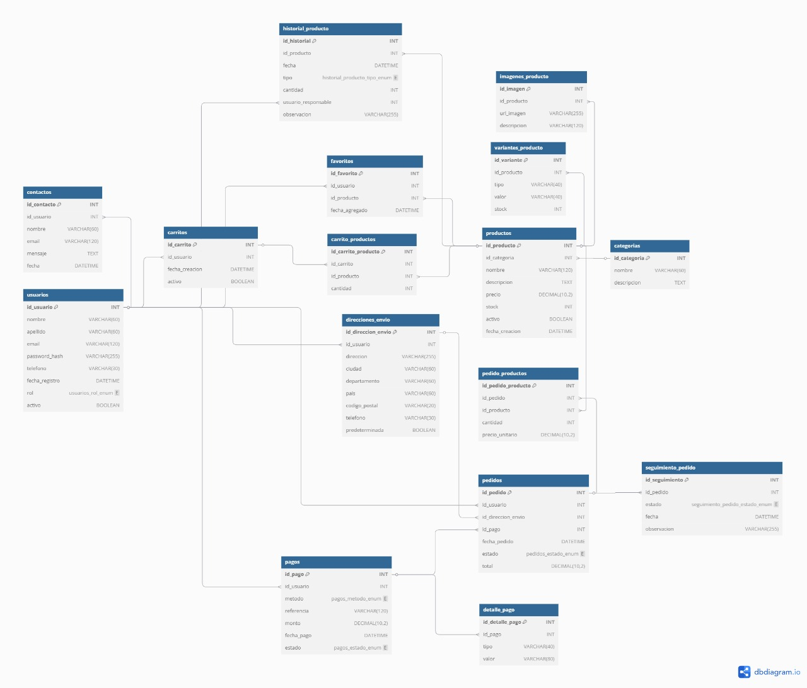

# Lógica del Backend y Base de Datos - Drakon Store

## 👥 Integrantes:
• Jefferson torres  
• Daniel contreras  
• Luis lindarte

---

## 🏗️ LÓGICA DEL BACKEND

### 1. ARQUITECTURA GENERAL
Este backend sigue una arquitectura MVC limpia (Modelo - Vista - Controlador) típica de Node.js con Express, separada en:
• **Modelo (Models)**: Clases JavaScript que representan las tablas en la base de datos usando ORM.
• **Controladores (Controllers)**: Contienen la lógica de negocio y manejan las solicitudes HTTP.
• **Rutas (Routes)**: Definen los endpoints REST que reciben y responden solicitudes HTTP.
• **Middleware**: Funciones que se ejecutan entre las solicitudes, como autenticación y validación.

Todo esto permite que la aplicación esté organizada, sea escalable y fácil de mantener.

### 2. GESTIÓN DE USUARIOS
**Entidad: Usuario**
Representa un cliente o administrador del sistema. Contiene campos como:
• id, nombre, apellido, email, password, telefono, direccion, fecha_creacion.

**Flujo de Registro/Login:**
• El usuario se registra desde un formulario en el frontend
• El controlador `AuthController` recibe los datos y los procesa usando `UserModel`
• Se implementa autenticación JWT para sesiones seguras
• Las contraseñas se hashean usando bcrypt antes de guardarlas

### 3. GESTIÓN DE PRODUCTOS
**Entidad: Productos**
Contiene:
• id, nombre, descripcion, precio, stock, descuento, categoria (como "camisetas", "gorras", "hoodies"), imagen, fecha_creacion.

**Operaciones disponibles:**
• **Crear producto** (POST /productos): Usado por administradores
• **Listar productos** (GET /productos): Con filtros por categoría, nombre, precio
• **Obtener producto** (GET /productos/:id): Ver detalles específicos
• **Editar y eliminar**: Para mantener el catálogo actualizado

Esto se conecta con la interfaz visual que muestra las colecciones de streetwear para diferentes categorías.

### 4. LÓGICA DEL CARRITO Y PEDIDOS
La lógica del carrito se maneja con las siguientes entidades:

**a) Entidad: Pedido**
Representa una orden hecha por un usuario. Contiene:
• id, id_usuario, fecha_pedido, total, estado, direccion_envio, metodo_pago.

**b) Entidad: Detalle_Pedido**
Representa cada producto dentro del pedido:
• id, id_pedido, id_producto, cantidad, precio_unitario, subtotal.

**Proceso completo del pedido:**
1. El usuario agrega productos a su "carrito" (manejado en frontend)
2. Una vez decide comprar, se genera un Pedido
3. Se crean varios Detalle_Pedido, uno por cada producto comprado
4. Se calcula el total, se actualiza el stock y se confirma el pedido

### 5. RELACIÓN ENTRE ENTIDADES

**Relaciones principales:**
• **Usuario** ➜ **Pedido** (1:N): Un usuario puede tener múltiples pedidos
• **Pedido** ➜ **Detalle_Pedido** (1:N): Un pedido puede tener múltiples productos
• **Producto** ➜ **Detalle_Pedido** (1:N): Un producto puede estar en múltiples pedidos
• **Categoria** ➜ **Producto** (1:N): Una categoría puede tener múltiples productos

Esto permite saber:
• Qué pedidos hizo cada usuario
• Qué productos se vendieron y en qué cantidad
• Cuál fue el total de una compra
• Qué usuario compró qué producto y cuándo

### 6. ENDPOINTS REST DISPONIBLES

**🔐 Autenticación (auth.routes.js)**
• `POST /auth/register` – Registrar usuario
• `POST /auth/login` – Iniciar sesión
• `POST /auth/logout` – Cerrar sesión
• `GET /auth/profile` – Obtener perfil de usuario

**👕 Productos (product.routes.js)**
• `GET /productos` – Listar todos los productos
• `GET /productos/:id` – Ver producto específico
• `POST /productos` – Crear producto (Admin)
• `PUT /productos/:id` – Editar producto (Admin)
• `DELETE /productos/:id` – Eliminar producto (Admin)
• `GET /productos/categoria/:categoria` – Filtrar por categoría

**🛒 Pedidos (order.routes.js)**
• `POST /pedidos` – Crear pedido
• `GET /pedidos` – Ver todos los pedidos (Admin)
• `GET /pedidos/usuario/:id` – Ver pedidos de un usuario
• `PUT /pedidos/:id/estado` – Actualizar estado del pedido
• `GET /pedidos/:id/detalles` – Ver detalles de un pedido

---

## 🔄 Ejemplo de Flujo Completo en la Aplicación

### 1. **Registro/Login**
El usuario se registra usando un formulario del frontend que envía datos a `AuthController` con encriptación de contraseña.

### 2. **Explorar Productos**
El usuario navega por las colecciones de streetwear. El frontend hace `GET /productos?categoria=camisetas`.

### 3. **Agregar al Carrito**
El usuario selecciona cantidad y productos. Esta lógica está en el frontend usando localStorage, pero al confirmar compra, envía los datos al backend.

### 4. **Confirmar Pedido**
El backend:
- Valida stock disponible
- Calcula totales con descuentos
- Actualiza inventario
- Guarda el pedido y sus detalles
- Responde con confirmación y número de pedido

### 5. **Panel de Administrador**
Los administradores pueden:
- Agregar nuevos productos de streetwear
- Gestionar inventario
- Ver estadísticas de ventas
- Actualizar estados de pedidos

---

## 🛠️ Tecnologías Implementadas

**Backend:**
- Node.js con Express.js
- JWT para autenticación
- Bcrypt para encriptación de contraseñas
- MariaDB/MySQL como base de datos
- Middleware de validación y seguridad

**Seguridad:**
- Tokens JWT con expiración
- Contraseñas hasheadas
- Validación de datos de entrada
- Protección contra ataques comunes (XSS, CSRF)
- Manejo seguro de sesiones

---

## 📊 Consideraciones de Rendimiento

- **Índices en base de datos** para consultas frecuentes
- **Paginación** en listados de productos
- **Cache** para productos más visitados
- **Validación** de stock en tiempo real
- **Transacciones** para operaciones críticas como pedidos

---

*Documentación técnica del proyecto Drakon Store - Plataforma de Streetwear*  
*Desarrollado por: Jefferson torres, Daniel contreras, Luis lindarte*  
*Supervisado por: Ing. Fanny Casadiego*
